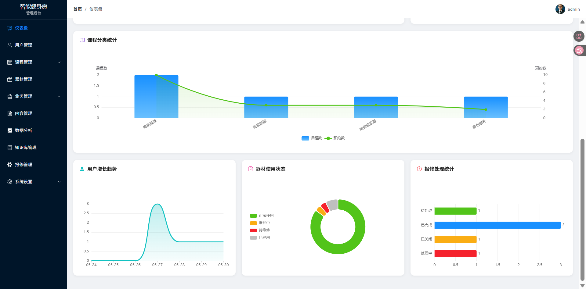
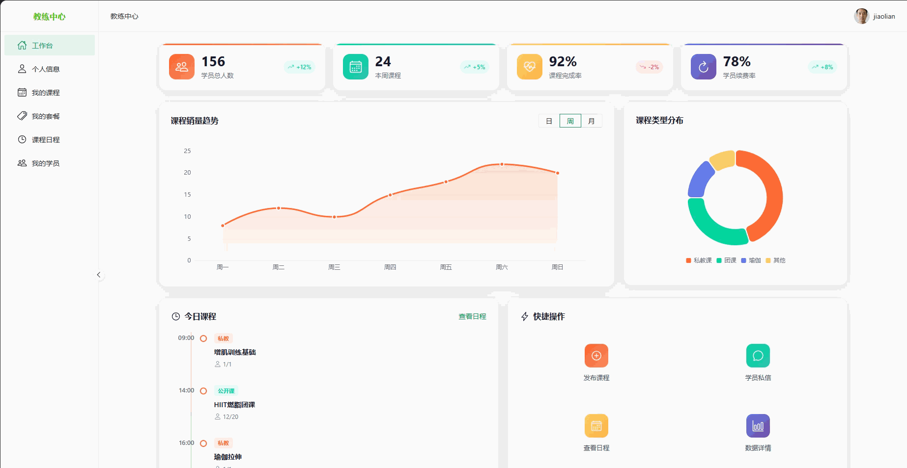

# AI-Powered Fitness System 智能健身房管理系统

<p align="center">
  
  
  
  
  
  
  
</p>

<p align="center">
  基于 Spring Boot + Vue 3 的全栈智能健身房管理平台，覆盖会员、教练、管理端和 AI 助手场景。
</p>

---

## 项目简介

AI-Powered Fitness System 是一个前后端分离的智能健身房管理系统。系统围绕健身房日常经营场景设计，提供课程预约、私教排期、会员卡、商品订单、器材报修、运营分析、知识库问答和 AI 健身助手等能力。

把 AI 能力放进真实业务流里：用户可以通过对话提出问题，系统结合会员资料、课程、教练、商品、会员卡、知识库等工具完成检索、推理和回答，并具有基于自然语言对话，实现AI自主决策与编排健身房约课、购卡、查数据等业务操作，提升用户全链路服务体验，释放前台及教练的运营人力成本。

## 使用界面

### 首页
- 所有角色共用入口：


### 管理员端界面



### 会员端界面


### 教练员端界面


除了基础的业务功能之外，使用Agent + RAG 的方案实现智能助手：   
...


## 系统角色

| 角色 | 说明 | 主要能力 |
|------|------|----------|
| 游客 | 未登录用户 | 浏览首页、课程、器材、教练信息和公开内容 |
| 会员 | 普通注册用户 | 课程预约、私教预约、AI 健身计划、AI 助手、器材报修、商品购买、会员卡管理 |
| 教练 | 健身教练 | 管理课程、排期、学生、私教套餐和个人主页 |
| 管理员 | 系统运营人员 | 用户、课程、器材、商品、订单、会员卡、知识库、字典、内容和运营数据管理 |

## 核心功能

### AI 智能能力

- AI 对话助手：支持流式回答和多轮上下文。
- Agent 工具调度：可按用户问题调用课程、教练、商品、会员卡、天气、时间、位置和 RAG 检索等工具。
- RAG 知识库问答：设计基于混合检索与Reranker重排的RAG知识库引擎。
- AI 健身计划：结合用户目标、身体数据和偏好生成训练建议。
- AI 运营分析：面向管理端生成业务数据分析报告。

### 业务能力

- 课程与预约：公开课程浏览、课程详情、会员预约、私教预约、教练确认和完成。
- 会员与教练：会员资料、健身档案、教练主页、学员管理、教练通知。
- 商品与订单：商品浏览、下单、订单管理。
- 会员卡系统：会员卡购买、激活、权益校验和到期处理。
- 器材与报修：器材展示、报修提交、后台维修处理。
- 内容与系统：公告、轮播图、字典配置、权限控制、文件上传。

<!--

-->

## 技术栈

### 后端

| 技术 | 版本 | 用途 |
|------|------|------|
| Spring Boot | 3.5.14 | 后端基础框架 |
| Java | 17 | 运行时与语言版本 |
| Spring Security | 6.x | JWT 认证与 RBAC 授权 |
| Spring AI Alibaba | 1.1.2.0 | DashScope、Agent、Graph、工具调用 |
| MyBatis-Plus | 3.5.7 | ORM 与逻辑删除 |
| PostgreSQL | 16+ | 业务数据库，支持 pgvector/jsonb |
| Flyway | 10.14.0 | 数据库迁移 |
| Redis | 7.2+ | 缓存、验证码、黑名单等 |
| MinIO | 8.5.11 | 对象存储 |
| Alipay SDK | 4.38.10.ALL | 支付宝支付 |
| springdoc-openapi | 2.8.17 | OpenAPI / Swagger 文档 |

### 前端

| 技术 | 版本 | 用途 |
|------|------|------|
| Vue | 3.5.30 | 前端框架 |
| Vite | 8.0.0 | 构建工具与开发服务器 |
| Vue Router | 5.0.3 | 路由管理 |
| Pinia | 3.0.4 | 状态管理 |
| Element Plus | 2.13.5 | 管理端 UI |
| Naive UI | 2.44.1 | 会员端、教练端 UI |
| ECharts | 6.0.0 | 图表展示 |
| Axios | 1.13.6 | HTTP 客户端 |
| marked / DOMPurify | 17.0.5 / 3.3.3 | Markdown 渲染与安全清洗 |

## 架构概览

```text
ai-powered-fitness-system/
├─ src/main/java/com/fitness/
│  ├─ FitnessApplication.java
│  ├─ common/                  # Result、异常、错误码、缓存、MyBatis 类型处理等
│  ├─ config/                  # Security、MyBatis-Plus、Redis、OpenAPI、异步配置
│  ├─ integration/             # AI、MinIO、支付、JWT、安全、短信集成
│  └─ modules/                 # 业务模块
│     ├─ user/                 # 用户、权限、教练学生关系、通知
│     ├─ course/               # 课程与场次
│     ├─ booking/              # 课程预约、私教预约
│     ├─ equipment/            # 器材与报修
│     ├─ membership/           # 会员卡与会员订单
│     ├─ product/              # 商品与商品订单
│     ├─ chat/                 # AI 助手、Agent、工具调用
│     ├─ plan/                 # AI 健身计划
│     ├─ knowledge/            # RAG 知识库
│     ├─ dashboard/            # 数据看板
│     ├─ analysis/             # AI 分析报告
│     ├─ system/               # 字典等系统能力
│     └─ ...
├─ src/main/resources/
│  ├─ db/migration/            # Flyway 数据库迁移
│  ├─ mapper/                  # MyBatis XML
│  └─ application.yml
├─ frontend/
│  ├─ src/
│  │  ├─ api/                  # 前端 API 封装
│  │  ├─ views/                # public / admin / member / coach
│  │  ├─ layouts/              # 三类端布局
│  │  ├─ components/           # 公共组件
│  │  ├─ stores/               # Pinia stores
│  │  ├─ router/               # 路由与守卫
│  │  └─ utils/                # 请求、鉴权、预约工具
│  ├─ package.json
│  └─ vite.config.js
├─ docker/fitness-ai-env/      # PostgreSQL、Redis、MinIO、RabbitMQ、MySQL、Ollama、Nginx
└─ pom.xml
```

后端按 `controller -> service -> mapper -> model` 组织；前端按视图域拆分为 `public`、`admin`、`member`、`coach`。管理端使用 Element Plus，会员端和教练端使用 Naive UI，避免 UI 库混用。

## 快速开始

### 环境要求

| 组件 | 建议版本 |
|------|----------|
| JDK | 17+ |
| Maven | 3.9+，也可直接使用项目内 `mvnw` |
| Node.js | 18+ |
| Docker / Docker Compose | 最新稳定版 |

### 1. 克隆项目

```bash
git clone git@github.com:coconuttree0730/ai-powered-fitness-system.git
cd ai-powered-fitness-system
```

### 2. 启动基础设施

```bash
cd docker/fitness-ai-env
docker-compose up -d
```

默认服务：

| 服务 | 端口 | 默认凭据 |
|------|------|----------|
| PostgreSQL | 5432 | `fitness_user` / `myPostgresPass123` |
| Redis | 6379 | `myRedisPass123` |
| MinIO | 9000 / 9001 | `minioadmin` / `minioPass123` |
| Ollama | 11434 | - |
| Nginx | 9080 | - |

Ollama 主要用于本地 Embedding 模型，例如 `embeddinggemma:300m`。如果你使用模型厂商提供的 Embedding 服务，可以按需替换配置。

### 3. 配置环境变量
请自行配置./docs/env-txt 中的内容（非正式项目我懒得规范的写.env相关服务，抱歉~）环境变量加入到系统环境变量
示例：


### 4. 启动后端

```bash
./mvnw spring-boot:run
```

或构建后运行：

```bash
./mvnw clean package -DskipTests
java -jar target/ai-powered-fitness-system-1.0.0.jar
```

### 5. 启动前端

```bash
cd frontend
npm install
npm run dev
```

### 6. 访问系统

| 入口 | 地址 |
|------|------|
| 前端开发服务 | http://localhost:3000 |
| 后端 API | http://localhost:8088/api/v1 |
| Swagger UI | http://localhost:8088/swagger-ui.html |
| MinIO 控制台 | http://localhost:9001 |
|...|...|

<!--

-->


## Git 提交规范

提交格式：

```text
type(scope): 主题
```

常用类型：

```text
feat      新功能
fix       修复 bug
docs      文档变更
style     格式调整，不改变行为
refactor  重构
perf      性能优化
test      测试相关
chore     构建、依赖或辅助工具
```

示例：

```bash
git commit -m "feat(chat): add agent tool calling"
git commit -m "fix(booking): prevent duplicate private coach booking"
git commit -m "docs: update README"
```

## 许可证
[](https://opensource.org/licenses/MIT)   

MIT License. See [LICENSE](LICENSE) file for details.


## 联系方式

- 作者：coconuttree0730 
- 联系方式：wu.zhongpeng@foxmail.com
- 项目主页：https://github.com/coconuttree0730/ai-powered-fitness-system
